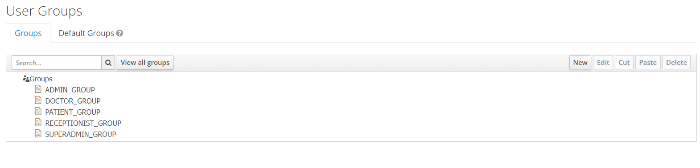
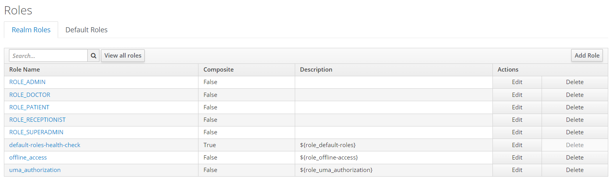
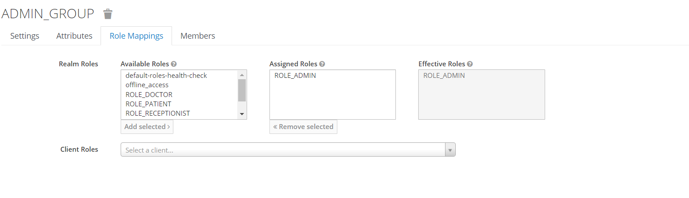
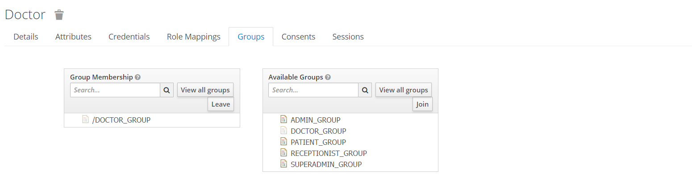

# How to setup authorization server locally:

1. Download [docker](https://www.docker.com/products/docker-desktop/)
2. Run [script](docker/keycloak.bat) on windows machines or [script](docker/keycloak.sh) on unix
3. Login into [admin console](http://localhost:8443) with username: admin and password:admin
4. Add new realm

5. Import realm using [file](./realm-export.json)

6. Ensue that users, groups and roles pages looks like beneath:

Groups:

Roles:

Group-Role mappings:

Ensure that all groups ale related to proper mappings and users, sample contains only example for admin

User-Group mappings:

